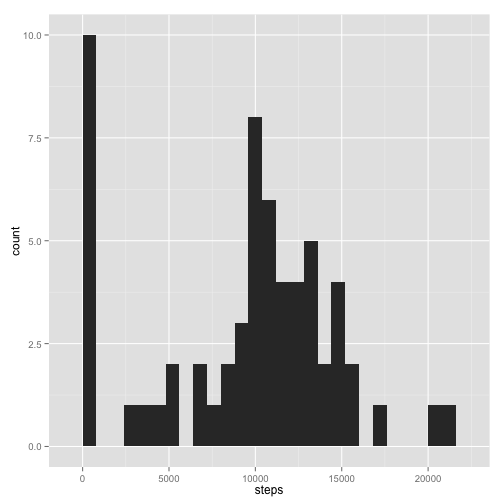
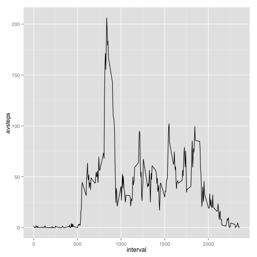
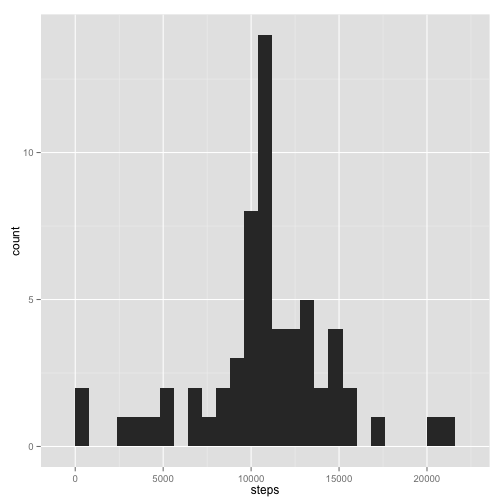
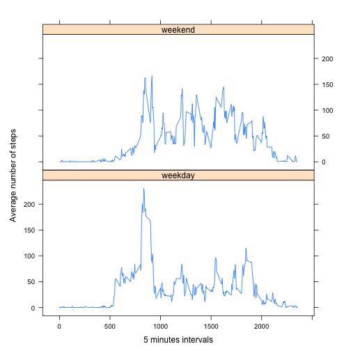

# Reproducible Research: Peer Assessment 1
---
title: "Reproducible Research: Peer Assessment 1"
output: PA1_template.md
  html_document: PA1_template.md
    toc: true
    theme: united
---
Jesus Martin - June 2015

## Loading and preprocessing the data

This requires to have the file "activity.zip" in your working directory


```r
unzip("activity.zip")
act <- read.csv("activity.csv")
act$date  <- as.Date(act$date)
```


## What is mean total number of steps taken per day?

Calculate the total number of steps taken per day


```r
suppressMessages(library(dplyr))
stepsperday <- act %>%
    group_by(date) %>%
    summarize(steps=sum(steps, na.rm=TRUE))
```

Make a histogram of the total number of steps taken each day
 

```r
suppressMessages(library(ggplot2))
qplot(steps, data=stepsperday,binwidth=800)
```

 

Calculate and report the mean and median of the total number of steps taken per day


```r
library(dplyr)
stepsperday %>% summarize(avsteps=mean(steps))
```

```
## Source: local data frame [1 x 1]
## 
##   avsteps
## 1 9354.23
```

```r
stepsperday %>% summarize(mediansteps=median(steps))
```

```
## Source: local data frame [1 x 1]
## 
##   mediansteps
## 1       10395
```


## What is the average daily activity pattern?


Make a time series plot (i.e. type = "l") of the 5-minute interval (x-axis) and the average number of steps taken, averaged across all days (y-axis)


```r
intervals <- act %>%
    group_by(interval) %>%
    summarize(avsteps=mean(steps, na.rm=TRUE))

qplot(interval,avsteps,data=intervals,geom="line")
```

 

Which 5-minute interval, on average across all the days in the dataset, contains the maximum number of steps?


```r
intervals[intervals$avsteps==max(intervals$avsteps),]
```

```
## Source: local data frame [1 x 2]
## 
##   interval  avsteps
## 1      835 206.1698
```

## Imputing missing values

Note that there are a number of days/intervals where there are missing values (coded as NA). The presence of missing days may introduce bias into some calculations or summaries of the data.

Calculate and report the total number of missing values in the dataset (i.e. the total number of rows with NAs)


```r
sum(is.na(act))
```

```
## [1] 2304
```

Devise a strategy for filling in all of the missing values in the dataset. The strategy does not need to be sophisticated. For example, you could use the mean/median for that day, or the mean for that 5-minute interval, etc.

In this case, we will replace NAs by the rounded mean of the 5 minute interval 


```r
act2 <- full_join(act, intervals, by="interval")
act2$avsteps <- as.integer(round(act2$avsteps))
na <- is.na(act2$steps)
act2$steps[na] <- act2$avsteps[na]
```
   
Create a new dataset that is equal to the original dataset but with the missing data filled in.


```r
actnona <- act2[,1:3]
```

Make a histogram of the total number of steps taken each day and Calculate and report the mean and median total number of steps taken per day. Do these values differ from the estimates from the first part of the assignment? What is the impact of imputing missing data on the estimates of the total daily number of steps?


```r
avstepsnona <- actnona %>%
    group_by(date) %>%
    summarize(steps=sum(steps))

qplot(steps, data=avstepsnona,binwidth=800)
```

 

```r
avstepsnona %>% summarize(avsteps=mean(steps))
```

```
## Source: local data frame [1 x 1]
## 
##    avsteps
## 1 10765.64
```

```r
avstepsnona %>% summarize(mediansteps=median(steps))
```

```
## Source: local data frame [1 x 1]
## 
##   mediansteps
## 1       10762
```

There is an increase in the average and median steps due to the substitution of NAs
by the average of the interval. Essentially, we were considering the NAs before as if
they were 0 and so it is visualized in the first histogram. This would be a simple way to
remove NAs avoiding other problems.

## Are there differences in activity patterns between weekdays and weekends?

We will use the dataset with the filled-in missing values for this part.

Create a new factor variable in the dataset with two levels – “weekday” and “weekend” indicating whether a given date is a weekday or weekend day.


```r
actnona$wday <- ifelse(weekdays(actnona$date) %in%
                           c("Sunday","Saturday"),"weekend","weekday")
```

Make a panel plot containing a time series plot (i.e. type = "l") of the 5-minute interval (x-axis) and the average number of steps taken, averaged across all weekday days or weekend days (y-axis). 


```r
suppressMessages(library(lattice))
intervalsnona <- actnona %>%
    group_by(interval,wday) %>%
    summarize(avsteps=mean(steps))

xyplot(avsteps~interval|factor(wday),data=intervalsnona,
       aspect=1/2,type="l",ylab="Average number of steps",xlab="5 minutes intervals")
```

 

